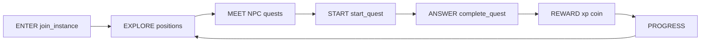
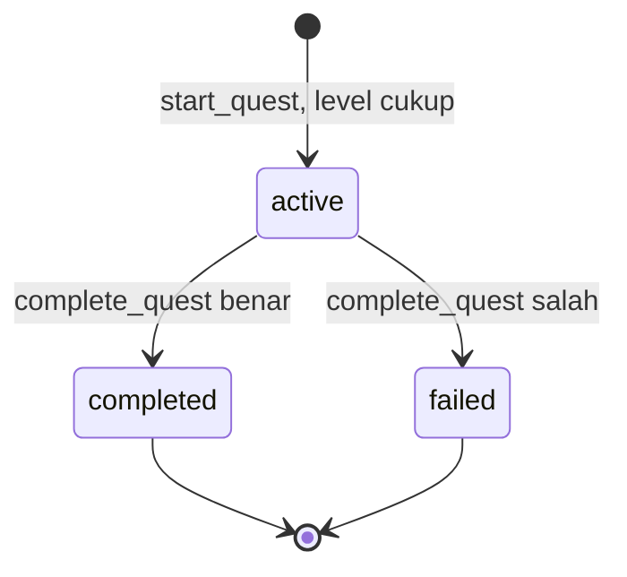
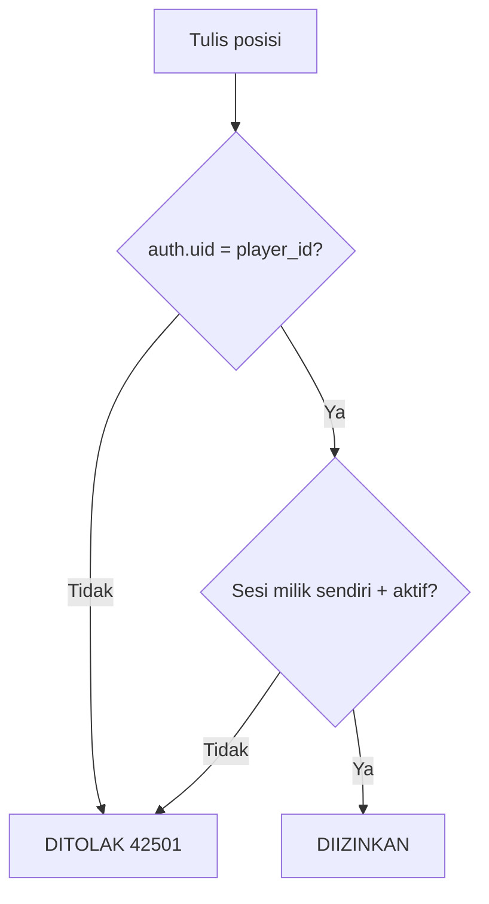
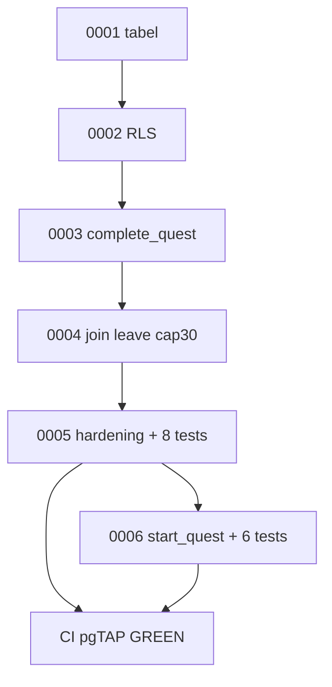
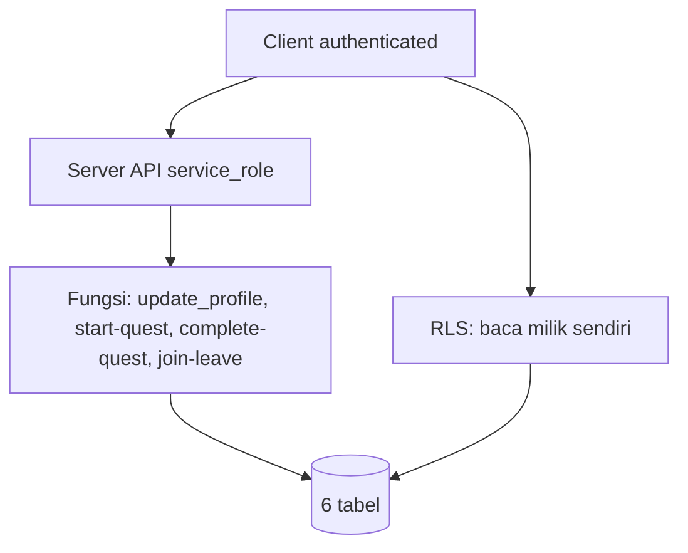

# BACKEND DIAGRAMS — alur visual (Mermaid, render otomatis di GitHub)

> Sumber: `CONTEXT.md` (core loop), `CONTRACTS.md` (status), migrasi `0001–0006`.

## 1. Core loop + penegakan backend

## 2. Siklus quest (`active → completed / failed`)

## 3. Keputusan tulis posisi (RLS 0005)

## 4. Urutan migrasi + CI

## 5. Lapisan RBAC

